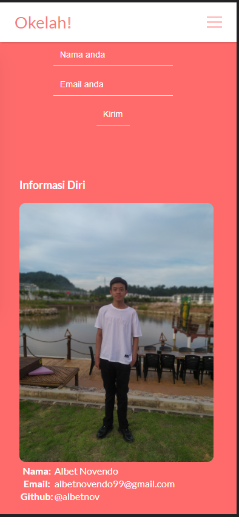

## Okelah!
Merupakan sebuah website sederhana yang dibuat dengan harapan agar tuntas di Submission Web Dasar dari Dicoding.

## Berikut Preview dari Okelah!

> Desktop Version

> Mobile Version

## Implementasi Javascript

Javascript digunakan untuk: 

- Dropdown Navbar versi Mobile (topbar.js)
- Mendapatkan tahun secara otomatis untuk footer pada bagian copyright. (copyright.js)